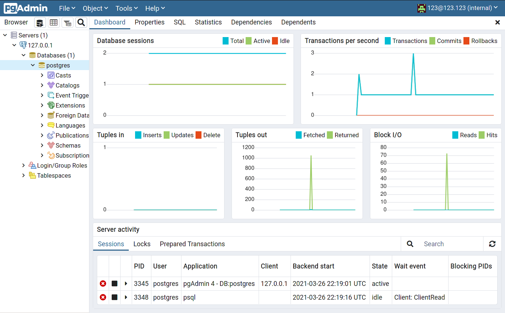

Установка СУБД PostgreSQL

Цель:  
Создать кластер PostgreSQL в докере или на виртуальной машине, запустить сервер и подключить клиента
- Развернуть контейнер с PostgreSQL или установить СУБД на виртуальную машину.
- Запустить сервер.
- Создать клиента с подключением к базе данных postgres через командную строку.
- Подключиться к серверу используя pgAdmin или другое аналогичное приложение.


Установка на Centos
```
# Install the repository RPM:
sudo yum install -y https://download.postgresql.org/pub/repos/yum/reporpms/EL-7-x86_64/pgdg-redhat-repo-latest.noarch.rpm

# Install PostgreSQL:
sudo yum install -y postgresql11-server

# Optionally initialize the database and enable automatic start:
sudo /usr/pgsql-11/bin/postgresql-11-setup initdb
sudo systemctl enable postgresql-11
sudo systemctl start postgresql-11

# Install pgAdmin:
yum install -y pgadmin4-redhat-repo.noarch
yum install -y pgadmin4

yum install -y nano
setenforce 0 # resolves pgadmin 500 internal server error
```

Настройка метода доступа trust, чтобы подключаться через pgAdmin без пароля
```
/var/lib/pgsql/11/data/pg_hba.conf

# TYPE  DATABASE        USER            ADDRESS                 METHOD

# "local" is for Unix domain socket connections only
local   all             all                                     peer
# IPv4 local connections:
host    all             all             127.0.0.1/32            trust
# IPv6 local connections:
host    all             all             ::1/128                 ident
# Allow replication connections from localhost, by a user with the
# replication privilege.
local   replication     all                                     peer
host    replication     all             127.0.0.1/32            ident
host    replication     all             ::1/128                 ident
```

Подключение через консоль
```
[root@psql data]# su - postgres
bash-4.2$ psql
psql (11.11)
Type "help" for help.

postgres=# \l
                                  List of databases
   Name    |  Owner   | Encoding |   Collate   |    Ctype    |   Access privileges   
-----------+----------+----------+-------------+-------------+-----------------------
 postgres  | postgres | UTF8     | en_US.UTF-8 | en_US.UTF-8 |
 template0 | postgres | UTF8     | en_US.UTF-8 | en_US.UTF-8 | =c/postgres          +
           |          |          |             |             | postgres=CTc/postgres
 template1 | postgres | UTF8     | en_US.UTF-8 | en_US.UTF-8 | =c/postgres          +
           |          |          |             |             | postgres=CTc/postgres
(3 rows)

postgres=# \conninfo
You are connected to database "postgres" as user "postgres" via socket in "/var/run/postgresql" at port "5432".
```

Настройка pgAdmin
```
[root@psql ~]# /usr/pgadmin4/bin/setup-web.sh
Setting up pgAdmin 4 in web mode on a Redhat based platform...
Creating configuration database...
NOTE: Configuring authentication for SERVER mode.

Enter the email address and password to use for the initial pgAdmin user account:

Email address: 123@123.123
Password:
Retype password:
pgAdmin 4 - Application Initialisation
======================================

Creating storage and log directories...
Configuring SELinux...
/usr/pgadmin4/bin/setup-web.sh: line 87: semanage: command not found
/usr/pgadmin4/bin/setup-web.sh: line 89: semanage: command not found
The Apache web server is not running. We can enable and start the web server for you to finish pgAdmin 4 installation. Continue (y/n)? y
Created symlink from /etc/systemd/system/multi-user.target.wants/httpd.service to /usr/lib/systemd/system/httpd.service.
Apache successfully enabled.
Apache successfully started.
You can now start using pgAdmin 4 in web mode at http://127.0.0.1/pgadmin4
```

Подключение через pgAdmin


